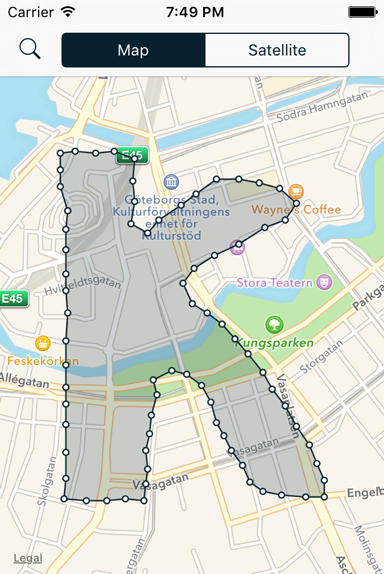

# Coordinatetest
Rendering a polygon shape of coordinates using MapKit in iOS 9.

* Fetch coordinates from an API endpoint (JSON)
* Parse JSON into linked node objects, where each node is connected its closest neighbors creating a shape.
* Display polygon shape of all connected nodes, as well as each individual node, on the map.

